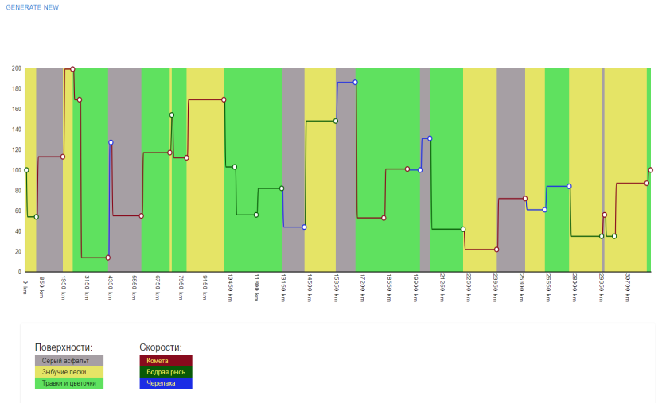

# Chart abilities demonstration

## Stack
React + TypeScript + Vite + Mui-x Charts

Code style
Eslint + Prettier + Husky(for git commits)

## Preview
 

## Backend swagger
https://charts.tarassov.space/swagger/index.html

## Backend repo
https://github.com/tarassov/ChartTestApi
